# Compressing What the Evaluator Can See

The comma video compression challenge looks, at first, like a video codec contest. We are given a fixed driving video, submit a compressed archive plus an inflation script, and the evaluator compares the inflated result against the original. The important twist is that the comparison is not PSNR, SSIM, VMAF, or human preference. The official score is:

```text
100 * SegNet distortion + sqrt(10 * PoseNet distortion) + 25 * compression_rate
```

That formula changes the problem. A normal codec spends bits on whatever makes the decoded video look like the camera stream: texture, noise, reflections, rain, glare, and tiny photometric details. This challenge rewards something narrower. The inflated video only needs to preserve what the two evaluator models respond to.

Our final local submission, `qrepro`, is built around that observation:

```text
archive.zip:        218,080 bytes
SegNet distortion:  0.00068872
PoseNet distortion: 0.00041977
compression rate:   0.00580842
exact score:        0.278872
```

The short version is that `qrepro` does not store a video in the usual sense. It stores semantic road-scene geometry, a tiny neural renderer, compact motion and brightness controls, and a few thousand sparse low-frequency RGB corrections. Inflation renders those ingredients back into RGB because RGB is the evaluator's required input format.

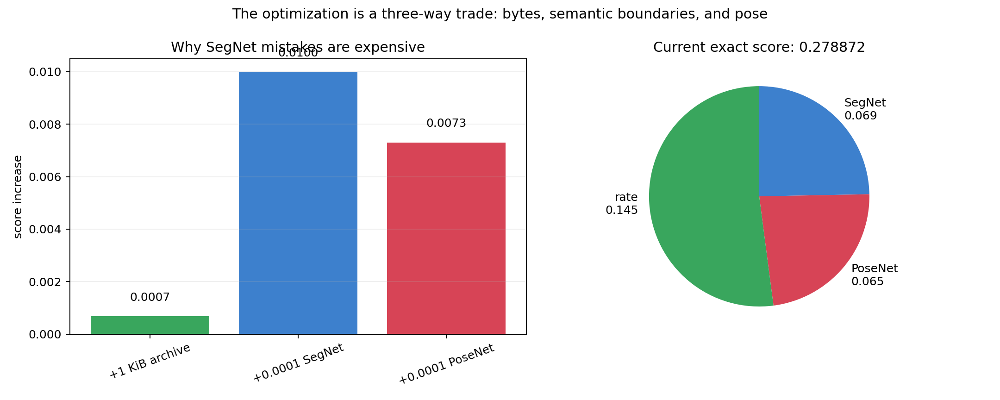

The score math explains why this representation works. One extra KiB costs only about `0.00068` score. A SegNet regression of `0.0001` costs `0.0100` score. Around our final operating point, a PoseNet regression of `0.0001` costs about `0.0073` score. Saving twenty KiB is therefore not useful if it damages semantic boundaries even slightly. Rate matters, but SegNet and PoseNet are too expensive to treat as secondary.

That became the design rule for the whole submission: spend bytes on road layout, horizon structure, lane-like edges, vehicle-like blobs, and pairwise motion cues. Spend almost nothing on texture unless it moves the official models.

## The Archive Is a Scene Program

The final archive is a single stored zip member named `p`. Inside that payload, the budget is:

```text
semantic mask stream: 152,431 bytes
FP4 neural renderer:   56,385 bytes
base pose/bias:         5,058 bytes
QRGB residuals:         4,106 bytes
zip overhead:             100 bytes
```

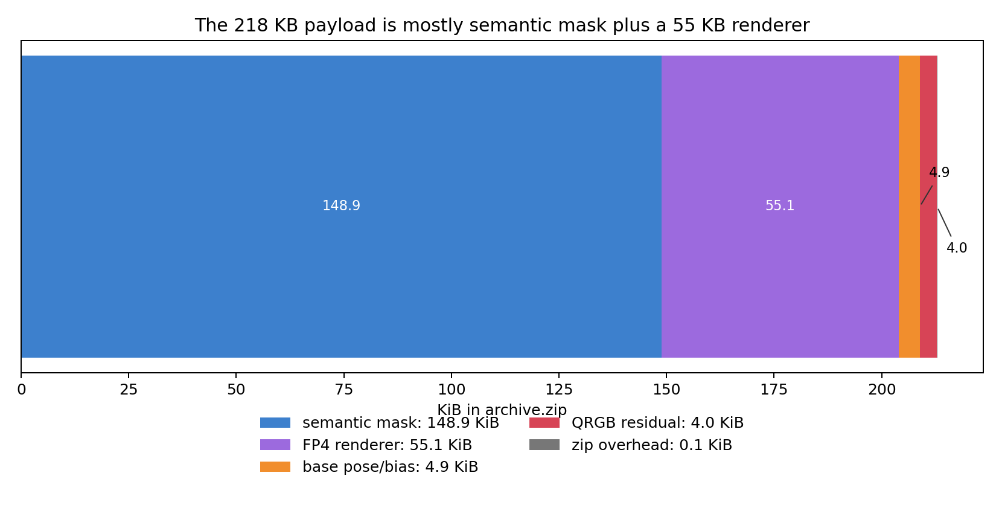

Most of the file is semantic. That is deliberate. SegNet disagreement is heavily weighted, and semantic structure is a better use of bytes than low-level RGB. The renderer is small enough to fit in about 55 KiB. The explicit pose and brightness controls cost about 5 KiB. The final residual control stream costs only about 4 KiB.

At inflation time, the process is:

1. Decode 600 semantic masks at `384 x 512`.
2. Decode the compact FP4 renderer.
3. Decode one pose vector and two frame biases per mask.
4. Decode sparse QRGB residual controls.
5. Render two RGB frames per semantic mask.
6. Upsample, clamp, round, and write the evaluator-facing video.

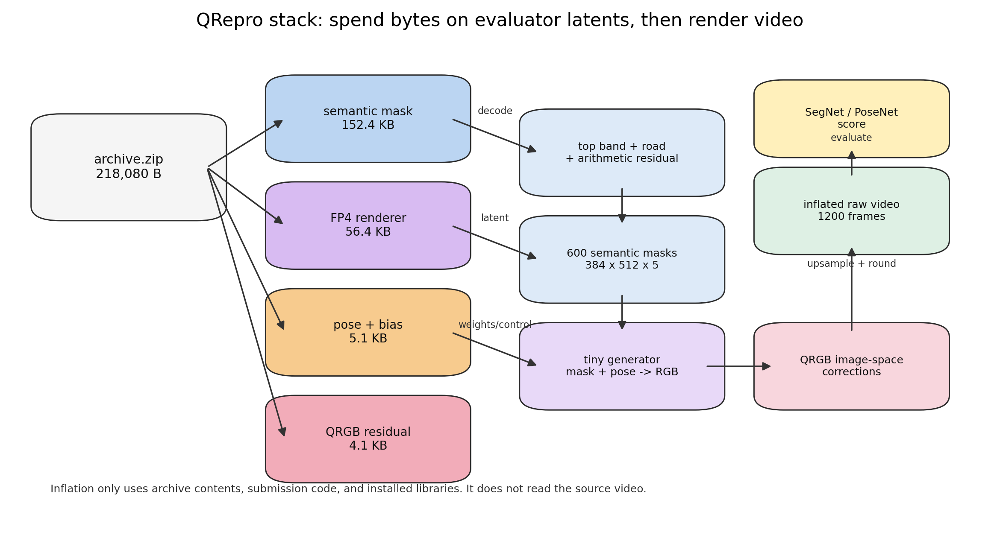

The submission is self-contained. During inflation, it reads only the unzipped archive payload, code in the submission directory, installed libraries, and the provided video names file for naming. The original video is used during training and analysis, but not during inflation. The compressed representation is the archive plus the included code.

## Why Store Semantics Instead of RGB?

The public video is a night driving clip. It has a lot of visual detail that is expensive and mostly unrewarded: low-light noise, headlight bloom, road texture, reflections, rain artifacts, and camera compression noise. If we store RGB, we pay for all of that. If we store semantics, we can spend bits on the parts that SegNet and PoseNet are more likely to care about.

The decoded semantic sequence is highly structured:

```text
top-band class:        49.52%
road class:            25.43%
everything else:       23.23%
thin foreground/lanes:  1.82%
```

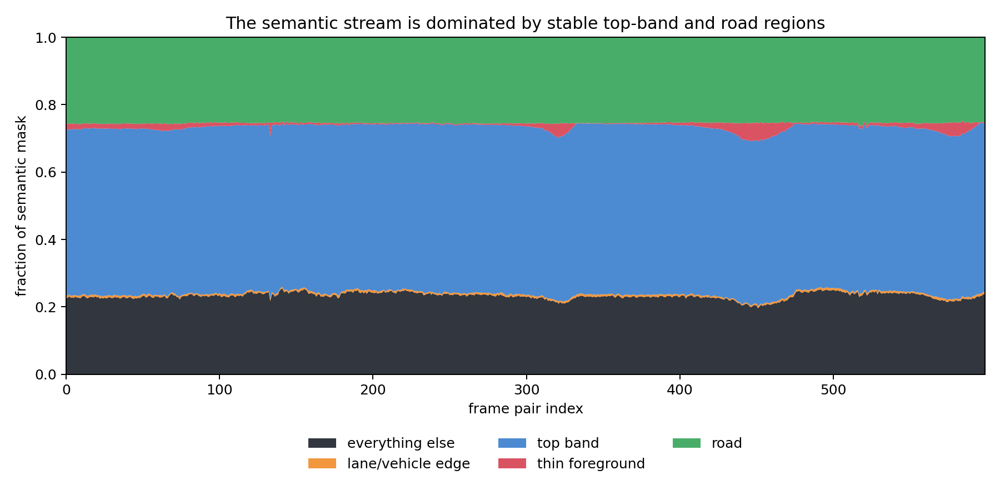

Almost half the pixels belong to a stable upper region. About a quarter belong to road. The thin, high-value structures are a tiny fraction of the image. A generic mask video codec can exploit some temporal redundancy, but it does not know that much of the frame is better represented as smooth road-scene geometry.

So the semantic codec removes the easy structure first. For each frame-pair mask, it stores a top cutoff and a road boundary, then arithmetic-codes the residual semantic content.

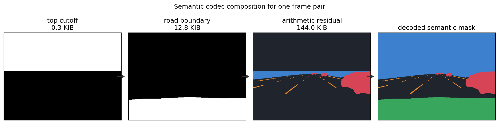

This is the core compression trick. The top support costs about `0.3 KiB` before outer compression. The road boundary costs about `12.8 KiB`. Those two pieces describe most of the large stable regions. The remaining stream carries the hard parts: lane markings, vehicles, shoulders, horizon detail, and boundary corrections.

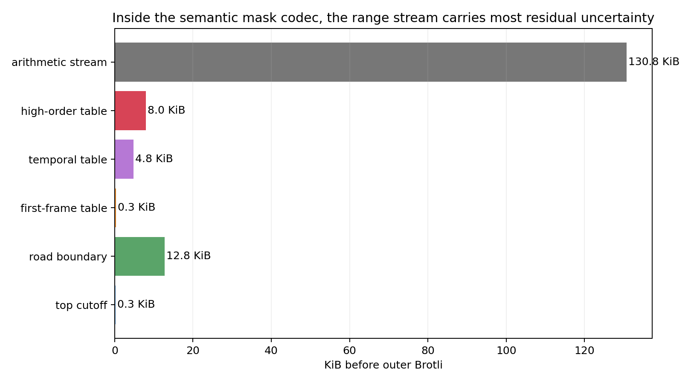

The range-coded residual is still the largest internal piece. That is expected. After the top and road geometry are removed, the residual contains exactly the pixels where mistakes are expensive.

The reason this decomposition is compact is visible if we look at the boundary curves over time.

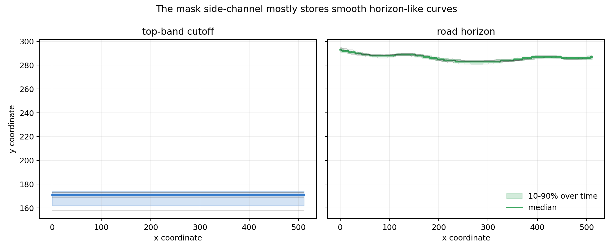

The road and top supports are not arbitrary images. They are smooth, slowly changing shapes. Encoding them as geometry is much cheaper than asking a generic image codec to rediscover that structure frame by frame.

After decoding, the mask still looks like a normal segmentation map, but it was not stored as one. It was assembled from top support, road support, and residual semantic classes.

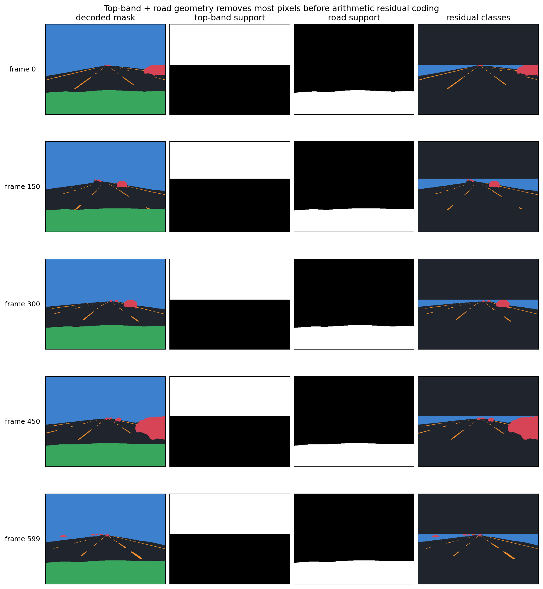

The renderer then treats this semantic mask as the scene scaffold.

## Rendering, Not Decoding

Once the archive has a compact semantic latent, it still needs to produce RGB frames. The naive goal would be to reconstruct the original pixels. `qrepro` instead uses a tiny neural renderer trained to produce evaluator-compatible RGB from the semantic scaffold and control streams.

The renderer is quantized into a compact FP4-style payload. It takes a semantic mask and pose vector and generates a pair of RGB frames. The output then follows the same kind of upsample, clamp, and round path that the evaluator sees.

This produces a video that looks odd if judged as human-facing compression.

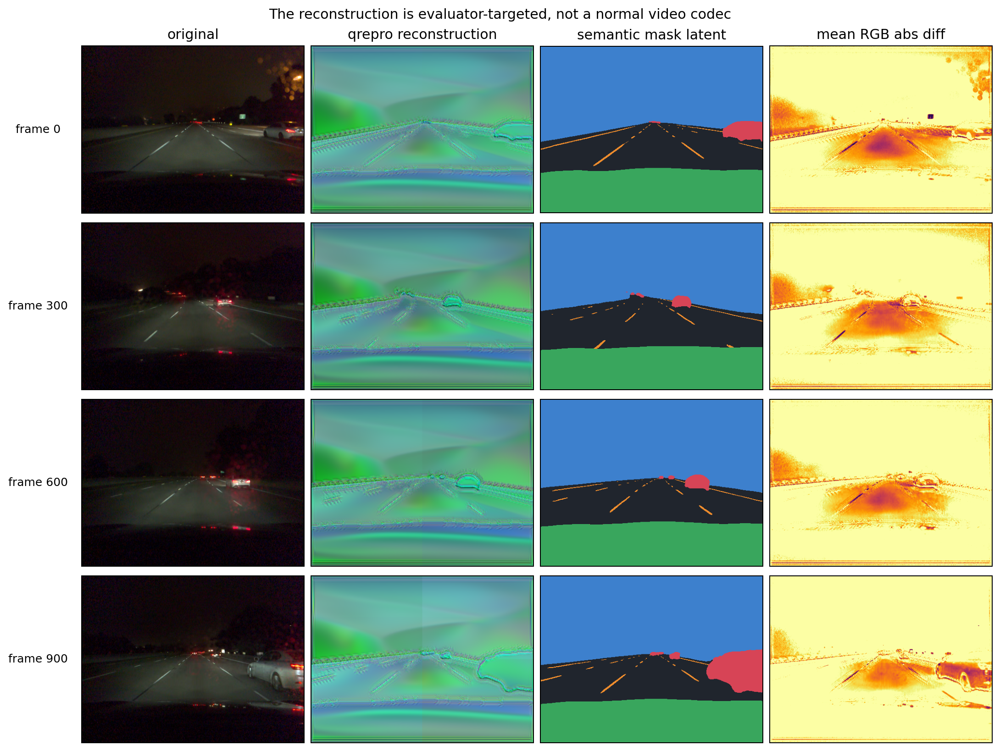

The original frame is a dark camera image. The reconstruction is smooth, synthetic, and visibly not a normal decoded video. But it preserves the large-scale road shape, lane-like lines, vehicle-like blobs, and motion-relevant structure. In this system, the semantic mask is the representation. The RGB frame is a projection into the evaluator's input space.

The same point is clearer over time.

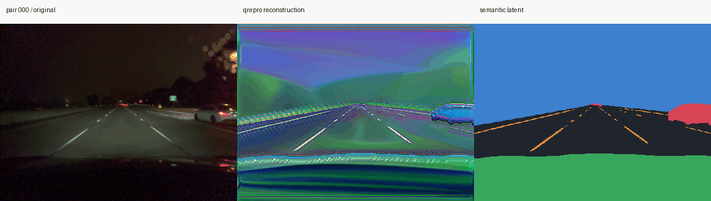

The reconstruction keeps stable geometry and temporal cues while dropping many details that dominate human perception. That would be the wrong tradeoff for a general-purpose codec. Under this metric, it is exactly the tradeoff we want.

## Pose Needs Its Own Handle

SegNet mostly measures per-frame semantic agreement. PoseNet measures the relationship between adjacent frames. A single semantic mask does not give enough control over that relationship, so the archive includes an explicit low-rate control stream:

```text
pose vectors:       600 x 6
base frame biases:  600 x 2
base control size:  5,058 bytes
```

The pose vector gives the renderer a compact frame-pair motion signal. The two biases give coarse brightness control for the generated pair. This is much cheaper than optical flow or per-frame texture, and it gives the renderer a consistent way to co-adapt semantic structure, brightness, and pairwise motion.

The important choice is that PoseNet control is not left to emerge accidentally from random texture. It is made explicit and low-rate.

## Four KiB of Model-Sensitive RGB Corrections

The last component is QRGB, a sparse residual control stream:

```text
compressed size:     4,106 bytes
nonzero int8 edits:  4,307
mean edits per pair: 7.18
max edits per pair:  16
value range:         [-24, 23]
```

These are not pixel patches. Each nonzero value is a scalar applied through a simple low-frequency image-space basis: global RGB offsets, horizontal halves, vertical halves, checker-like quadrants, and coarse vertical bands.

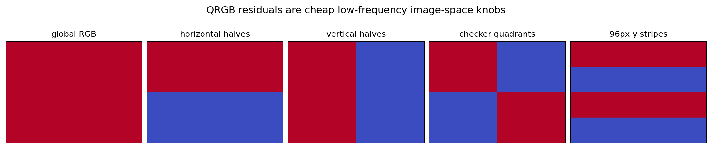

The basis is intentionally crude. With only a handful of scalar edits per frame pair, it can move broad regions of the generated image in ways that affect the official models.

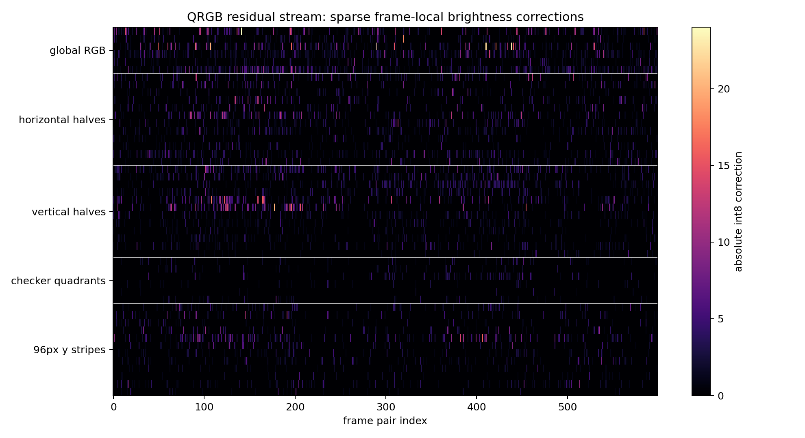

The heatmap shows how sparse the edits are across time and basis dimension. QRGB is not drawing details back into the video. It is making small frame-local corrections where a broad color or brightness shift buys more score than it costs in bytes.

Expanded into image space, those few scalars become structured low-frequency correction maps.

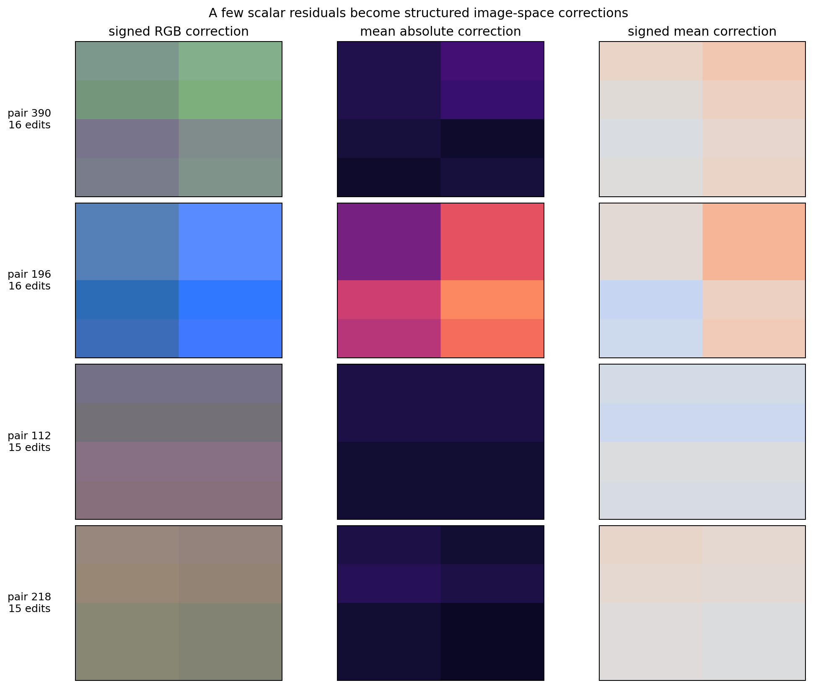

This is a useful final-stage tool because it is cheap, global, and metric-facing. At 4 KiB, it only needs to fix a small number of model-sensitive errors to be worth including.

## The Failure Cases Explain the Design

A metric-targeted codec cannot be judged by visual quality alone. We computed local per-frame SegNet and PoseNet distortions with the official models and plotted them over the clip.

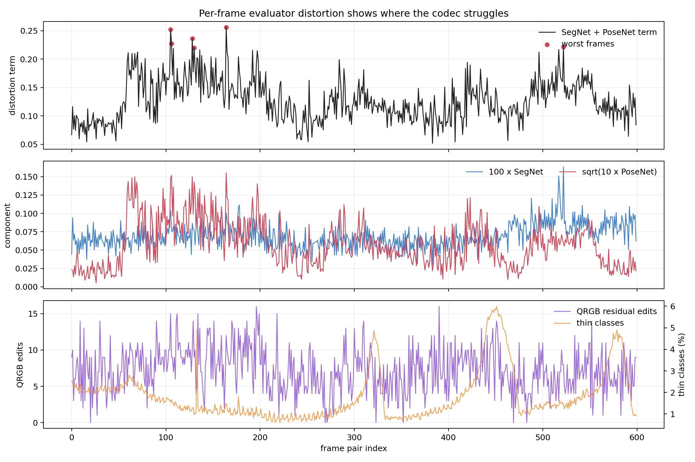

The errors are not uniform. Stable road geometry is relatively easy. Scene transitions, signs, vehicles, ambiguous boundaries, and hard motion cases produce spikes. SegNet and PoseNet also fail differently: some frames are boundary problems, while others are pairwise motion problems.

That split is exactly why the final archive has separate semantic, pose, and QRGB components. The mask stream carries per-frame scene layout. The pose stream handles pairwise behavior. QRGB gives a very small number of broad image-space corrections when the base renderer is close but not quite right.

The best/worst gallery makes this more concrete.

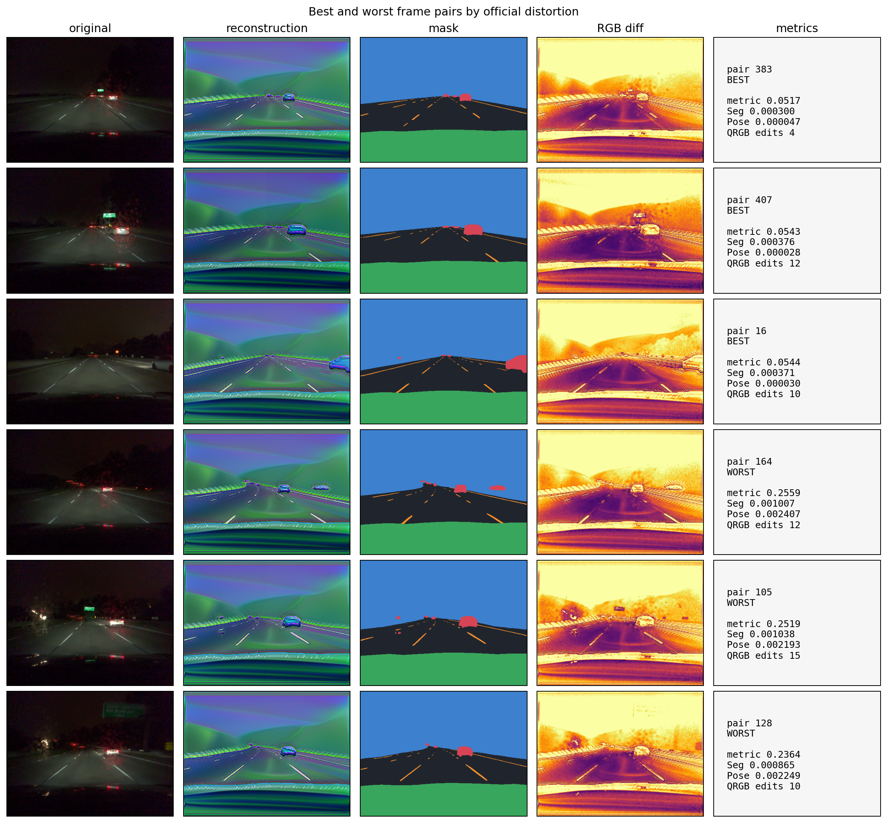

The best frames are not beautiful; they preserve the evaluator-relevant scene layout. The worst frames show where the representation is still narrow. Boundary-sensitive structures and hard pose cases can produce large distortion even when the reconstruction does not look qualitatively much worse to a person.

This is the right lesson to take from the failures. The method works because the video is fixed, the evaluator is known, and road-scene geometry is structured. It is not a general-purpose codec.

## Why the Last Improvement Crossed 0.28

The final score was not achieved by making the smallest archive we tried. The `218,080` byte version is slightly larger than an earlier `0.283` variant, but it scores lower because the distortion terms improved enough to pay for the bytes.

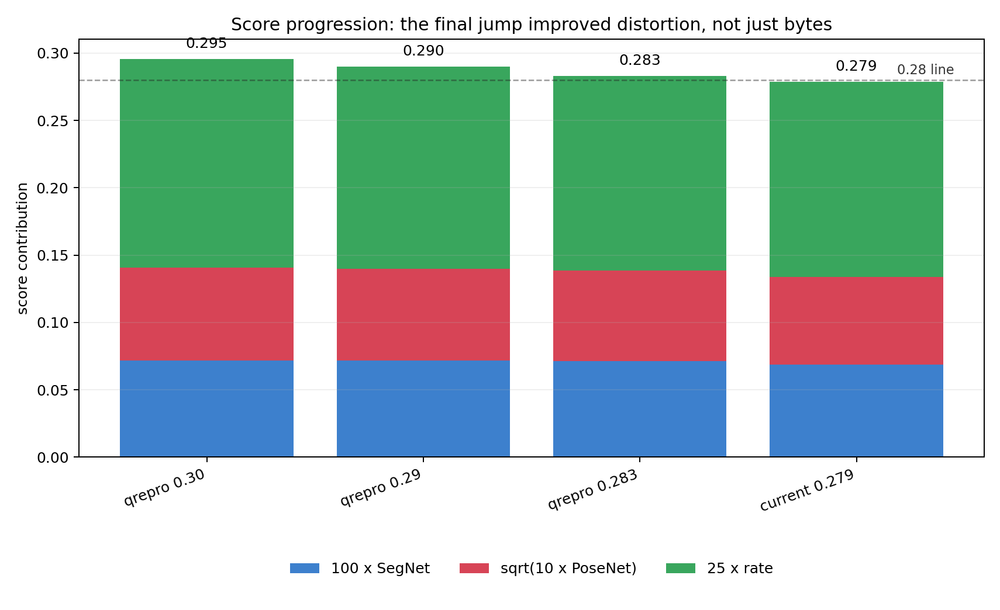

The final component terms are:

```text
SegNet term:  0.068872
PoseNet term: 0.064790
Rate term:    0.145211
Total:        0.278872
```

The rate term is still the largest single term, but the distortion terms are too expensive to ignore. Many apparent wins from saving bytes were fake progress because they damaged SegNet boundaries or PoseNet consistency. The useful improvements were the ones that kept the archive small while preserving semantic and temporal agreement.

That is the main practical result: below this size, compression is not just about deleting bytes. It is about deleting the bytes the evaluator does not see.

## Takeaway

`qrepro` is best understood as a tiny evaluator-facing simulator for a fixed road scene.

It stores road-scene structure, enough motion control to satisfy PoseNet, and enough low-frequency RGB flexibility to patch model-sensitive errors. It then renders an RGB video that is strange to humans but meaningful to the official models.

The broader lesson is simple: when the metric is model-based, the best compressed representation may not look like the thing being compressed. It only has to preserve what the metric can see.
